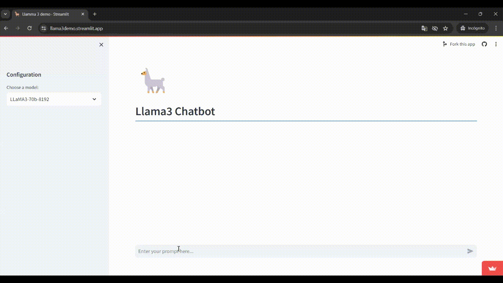

# Llama 3 Streamlit App

[](https://llama3demo.streamlit.app/)



Welcome to the Llama 3 Streamlit App, your gateway to one of the most powerful large language models (LLMs) available today—Llama3! Whether you're looking to harness the mighty 70b model or prefer the swiftness of the 8b version, our app has you covered. Powered by the lightning-fast Groq API, this interface isn't just quick—it's instantaneous. Don't take our word for it; try it out and see how it stacks up against ChatGPT!

## Requirements
- Streamlit
- Groq 
- Python 3.8 or higher

## Installation
Get started with just a few commands! You can use either `pdm` or `pip` to install the necessary dependencies:

Using pdm:
```bash
pdm add streamlit groq
```

Using pip:
```bash
pip install streamlit groq
```
**Note**: You'll need a Groq API key to run the app. Be sure to add your key to the **secrets.toml** file.

## Running the app
To launch the Llama 3 interface, go to the file directory and enter the following command:

If using Streamlit directly:
```bash
streamlit run app.py
```
If using pdm:

```bash
pdm run streamlit run app.py
```

Dive into the world of advanced conversational AI with Llama 3 and experience next-level chatbot interactions today!

